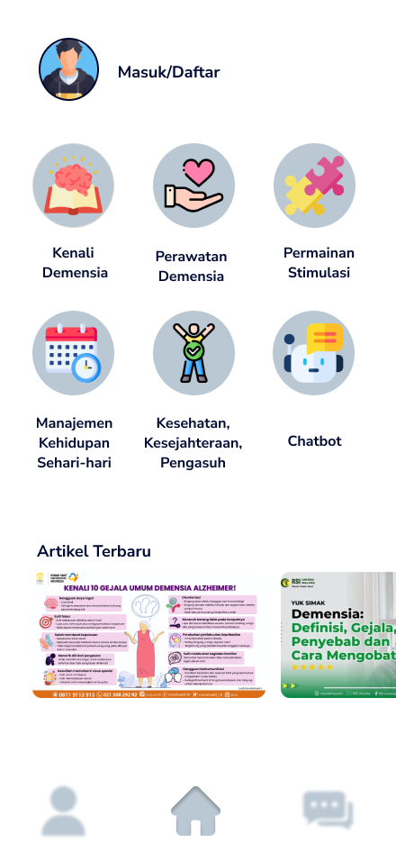
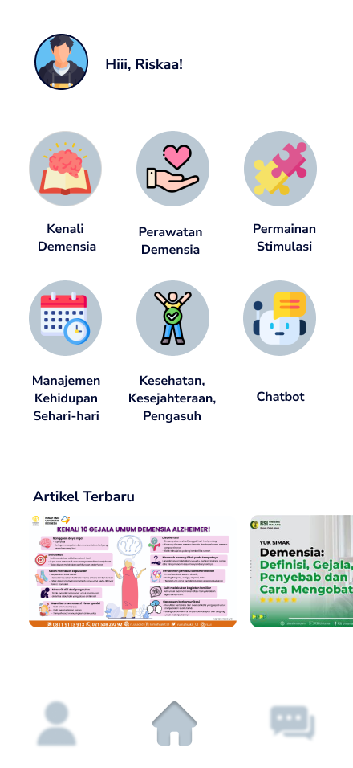
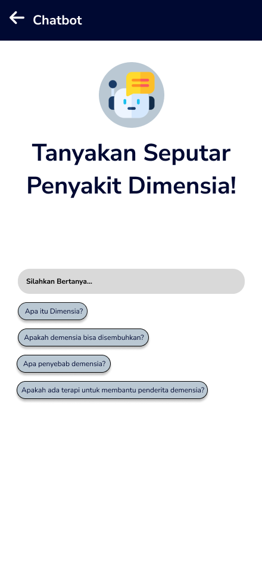
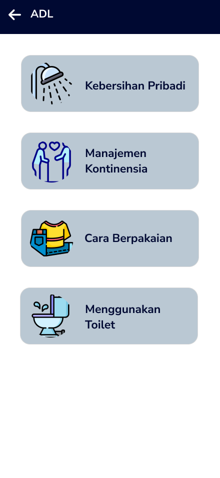
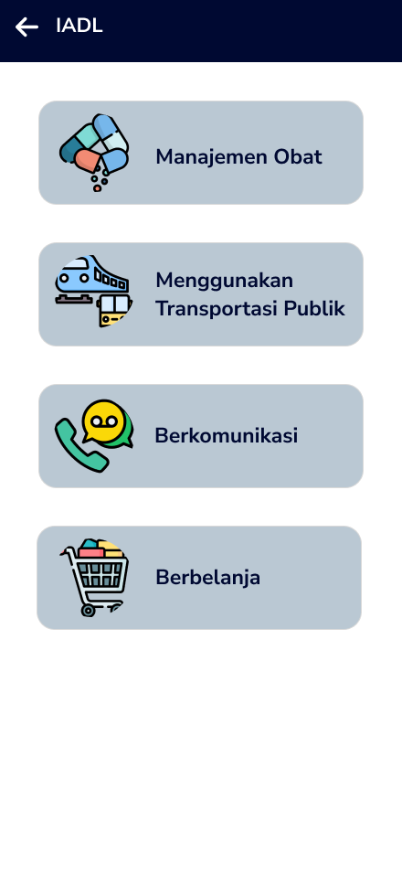
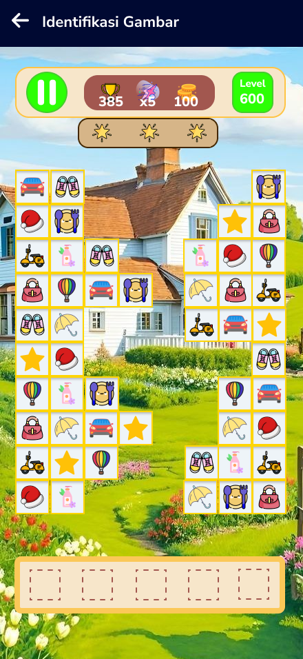
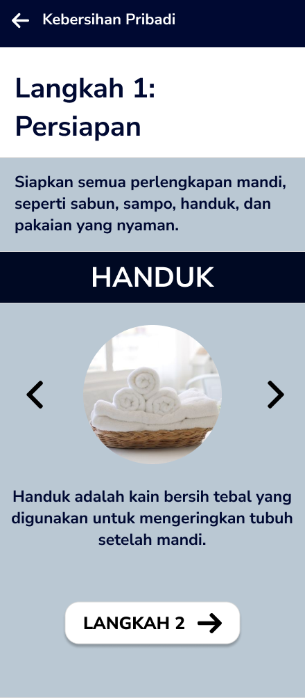

# E-Health Mobile App Design for Dementia Patients

## Project Overview

E-Health merupakan desain aplikasi mobile yang dirancang untuk membantu pasien demensia dalam menjalankan aktivitas sehari-hari secara lebih mandiri. Aplikasi ini menyediakan fitur pengingat aktivitas, panduan aktivitas harian, identifikasi gambar, serta chatbot sebagai pendamping digital. Desain aplikasi dibuat dengan pendekatan **User-Centered Design** agar mudah digunakan oleh pasien dan caregiver.

---

## Problem

Pasien demensia sering mengalami kesulitan dalam mengingat aktivitas harian seperti makan, menjaga kebersihan diri, dan melakukan kegiatan rumah tangga. Selain itu, pasien juga membutuhkan panduan visual sederhana agar dapat mengikuti langkah-langkah aktivitas dengan lebih mudah.

---

## Solution

Aplikasi ini dirancang untuk:

* Membantu pasien mengingat aktivitas harian
* Menyediakan panduan aktivitas secara visual dan sederhana
* Memberikan bantuan melalui chatbot digital
* Membantu pasien mempertahankan kemandirian dalam kehidupan sehari-hari

---

## Target Users

* Pasien demensia
* Keluarga atau caregiver pasien
* Tenaga kesehatan yang mendampingi pasien

---

## Prototype & Design File

🔗 View Full Prototype in Figma
https://www.figma.com/design/kSKrrdnha3gYU5hMTm9ac7/EHEALTH?node-id=143-183

---

## User Interface Design

### Home Page (Before Login)

### Home Page (After Login)

### Chatbot Feature

### ADL Feature (Activities of Daily Living)

### IADL Feature (Instrumental Activities of Daily Living)

### Identitas Gambar

### Kebersihan Pribadi

---

## Design Tools

* Figma
* User Centered Design Method
* Mobile UI Design

---

## Author

**Fariska Dwi Kartika Sari**
S1 Sistem Informasi – Universitas Airlangga
